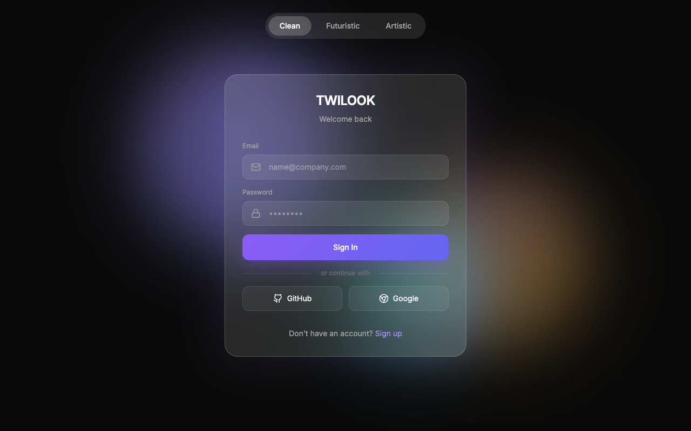
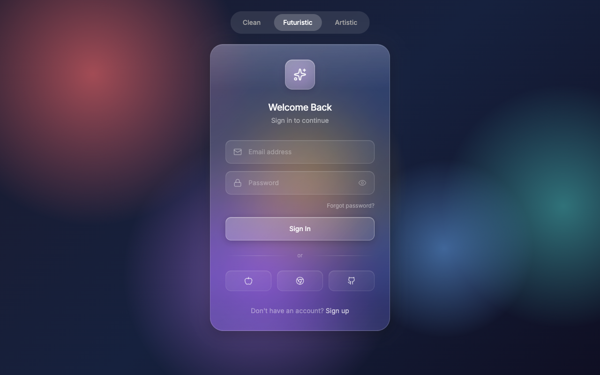
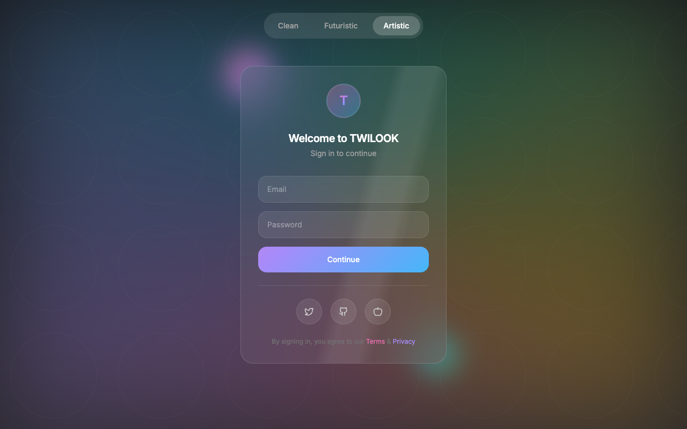

# Login Screens Collection

A diverse collection of modern, responsive, and aesthetically pleasing login screen designs, implemented in a single HTML file using Tailwind CSS. All designs feature smooth animations, glassmorphism effects, and a premium user interface.

## 📸 Gallery

### 1. Clean & Modern

### 2. Futuristic (Liquid Glass)

### 3. Artistic (Holographic)

## 🌟 Features

This project includes **three unique login screen variations**, switchable via a navigation tab at the top:

1.  **Clean & Modern**:
    *   Minimalist design with a dark theme.
    *   Subtle animated gradient orbs in the background.
    *   Glassmorphism card effect with blur filters.
    *   Smooth input focus states and button hover effects.

2.  **Futuristic (Liquid Glass)**:
    *   Vibrant, colorful background with floating, animated blobs.
    *   "Liquid Glass" card aesthetics with high-gloss reflections.
    *   Deep animated gradients and rich color palettes.
    *   Interactive elements that feel tactile and responsive.

3.  **Artistic (Holographic)**:
    *   Dark, immersive theme with holographic accents.
    *   Conic gradients and mesh text layers.
    *   Shimmering borders and futuristic glow effects.
    *   Unique entrance animations for a dynamic feel.

## 🛠 Technologies

*   **HTML5**: Semantic structure.
*   **Tailwind CSS** (via CDN): Utility-first styling for rapid UI development.
*   **JavaScript**: Simple logic to toggle between the different screen designs.
*   **Iconify** (via CDN): Vector icons for social logins and input fields.
*   **Google Fonts**: Uses the 'Inter' font family for clean typography.

## 🚀 Getting Started

No installation needed! Since this project uses CDNs for libraries, you can run it directly from your file system.

1.  **Clone** or **Download** this repository.
2.  Open `Login screens.html` in any modern web browser (Chrome, Firefox, Safari, Edge).
3.  Use the tabs at the top of the screen to switch between the **Clean**, **Futuristic**, and **Artistic** designs.

## 🎨 Customization

You can easily customize the styles by editing the Tailwind utility classes in `Login screens.html`. 
The custom animations (like `float`, `shimmer`, `gradient`) are defined in the `<style>` block at the bottom of the file.

## 📄 License

This project is open-source and available for personal and commercial use.
